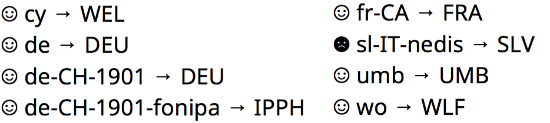

# Localized Forms

If you write software that renders text, for example a word processor,
a web browser, or an operating system library, we hope that you’ll
find `TestFont-LocalizedForms.otf` useful for testing.




## What are localized letter forms?

In Asian languages such as Chinese, Japanese, and Korean, many
characters look very similar. Therefore,
[Unicode](http://unicode.org/standard/WhatIsUnicode.html) has assigned
them a single codepoint; this is called “[Han
Unification](https://en.wikipedia.org/wiki/Han_unification).” However,
while these characters have the same root and the same meaning, their
typographic rendering style is recognizably different across
languages. To render text in acceptable quality, a graphics library
needs to know the text langauge. If the font supports this,
typographic adjustments will tweak the appearance of the text.

Localized forms also exist in languages outside of Asia.
An example is Polish, where the “kreska” mark on the letters ćńóśź
should be [slightly less angled](https://glyphsapp.com/tutorials/localize-your-font-polish-kreska) than in other languages. Another example is
[Wolof](https://en.wikipedia.org/wiki/Wolof_language) versus
[Sami](https://en.wikipedia.org/wiki/Sami_languages), which both
use the [eng letter Ŋŋ](https://en.wikipedia.org/wiki/Eng_%28letter%29)
but in slightly different style.


## Why should I care?

If you build a web browser, typesetting system, or similar
software application, you should make sure that localized letter
forms work correctly; you system will work better for text in
certain languages. Of course, there’s always things beyond your
control that can go wrong. For example, if you receive input
tagged with the wrong language, or if your operating system comes
with buggy fonts, there is not much you can do.  But if your
software passes this test, you can be reasonably sure that your
system has done its part of the overall picture.


## How to identify languages?

Modern web browsers (and similar software) use a tagging system
called [IETF BCP47](https://www.w3.org/International/articles/language-tags/)
for identifying languages. For example, the BCP47 code for the Welsh
language is `cy`. But not all BCP47 codes are just
two letters: for example, de-LI-fonipa means German as used in
Liechtenstein, written with the symbols of the International
Phonetic Alphabet. Should you build a build a new software library
for handling text, its interface should definitely take BCP47 codes.

However, since OpenType is much older than BCP47, its fonts have
differnt language tags. For example, the OpenType code for Welsh is
`WEL`.  Your text rendering software needs to bridge this gap, and
this test font can help making sure that there are no bugs.


## What does the font do?

The test font will always rewrite letter sequences like `OT:WEL` to a
face symbol.  If the font’s `loca` feature for Welsh has been
activated, this face will be a smiley; otherwise, it will have a
frowning look.  The frowning version also uses much more ink,
so it is easy to spot among a sea of smileys.

The font has a `loca` feature for every [language system
tag](https://www.microsoft.com/typography/otspec170/languagetags.htm)
defined in OpenType 1.7.


## How can I use this font?

It depends on what system you want to test. To test a web browser,
write HTML snippets like this.

```html
  <div lang="cy">OT:WEL cy → WEL</div>
  <div lang="de">OT:DEU de → DEU</div>
  <div lang="de-CH-1901">OT:DEU de-CH-1901 → DEU</div>
  <div lang="de-CH-1901-fonipa">OT:IPPH de-CH-1901-fonipa → IPPH</div>
  <div lang="fr-CA">OT:FRA fr-CA → FRA</div>
  <div lang="IT-nedis">OT:SLV sl-IT-nedis → SLV</div>
  <div lang="umb">OT:UMB umb → UMB</div>
  <div lang="wo">OT:WLF wo → WLF</div>
```
